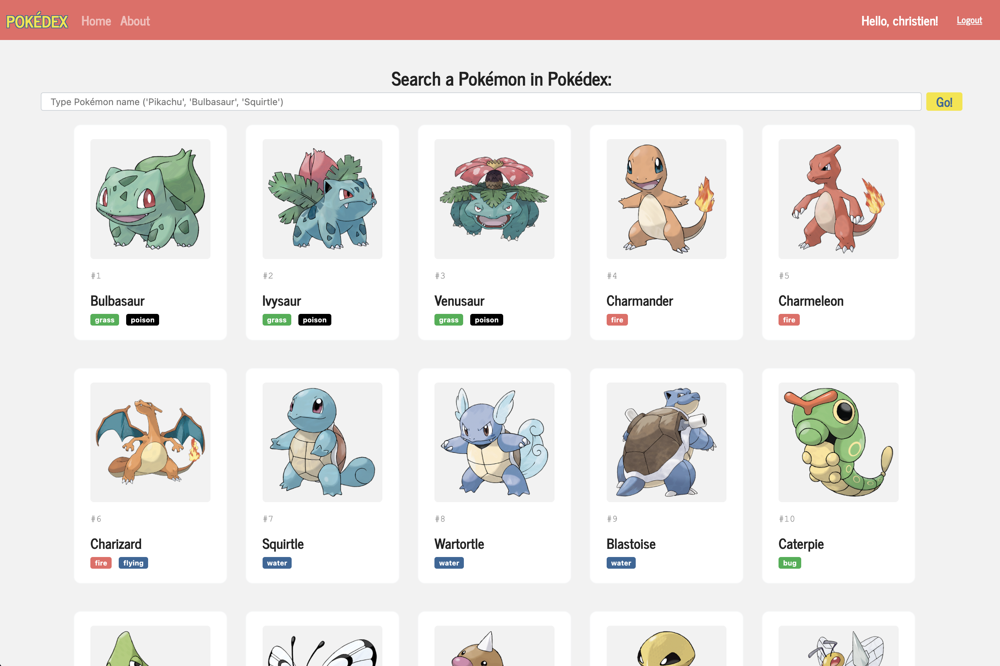
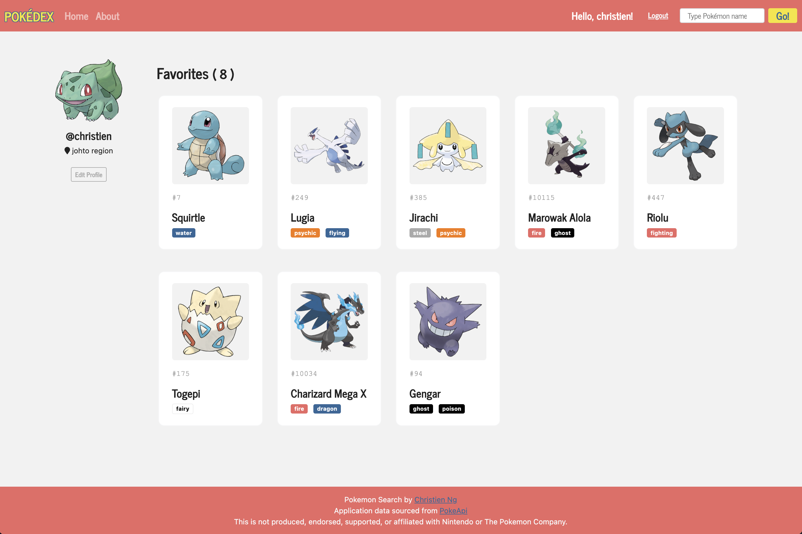
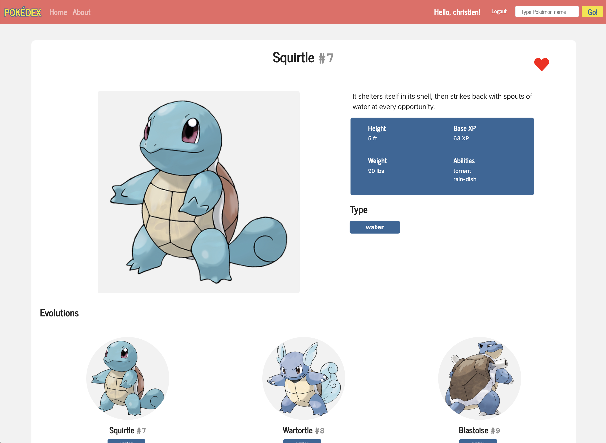

<div align='center'>
    
</div>

<div align="center">
   <a href="https://www.linkedin.com/in/christienng/">
      
   </a>
  <a href='https://pokeapi.co/' >
    
  </a>
</div>

<div align="center">
    <sub>Built with ❤︎ by <a href="https://github.com/cng008">Christien Ng</a></sub>
</div>

# :pushpin: **Table of Contents**

- [Live Website](#live-website)
- [Purpose and Features](#dart-purpose-and-features)
- [API](#thought_balloon-api)
- [Technologies](#computer-technologies)
- [How to Run](#construction_worker-how-to-run)

## **Live Website**

### 👉[Click here to open website](https://cng-pokedex.onrender.com/)

---

# :dart: **Purpose and Features**

- Responsive Pokédex Application (partial) for study purposes with REST API.

## **Overview**

The number of Pokémon GO players has been steady since its launch in 2016 with [almost 2 million daily active loyal users](https://www.statista.com/statistics/604551/pokemon-go-daily-active-users-in-europe/).

The goal of this app is to provide users a method to explore a well-documented archive of Pokémon.

With so many Pokémon, this application provides users a way to easily search any Pokémon without any extra frills or ads. Details for the individual Pokémon include their types, moves, and other statistics.

---

## **Features**

> The main feature of this application is to allow users to search a large and well-documented database of all existing Pokémon. All users regardless of being logged in, will be able to search and see their details.

[](static/images/md/homepage.png)

> Users have the option to create an account which allows the ability to save their favorite Pokémon where they can then view on their profile.

[](static/images/md/user_profile.png)

> Users can click on a Pokémon to see its details.

[](static/images/md/pokemon_details.png)

## NEW FEATURE:

> try catching a pokemon (clicking on the sprite image) in the pokemon details page

---

## :thought_balloon: **API**

This application was created using data from the <ins>**PokeAPI**</ins>. All card details and images are sourced from the API's database.

#### API Overview

> https://pokeapi.co/

#### API Documentation:

> https://pokeapi.co/docs/v2

---

# :computer: **Technologies**

This project was made using the following technologies:

- [Python](https://docs.python.org/3/)
- [HTML](https://developer.mozilla.org/en-US/docs/Web/HTML)
- [CSS](https://developer.mozilla.org/en-US/docs/Web/CSS)
- [Bootstrap 5](https://getbootstrap.com/docs/5.1/getting-started/introduction/)
- [Font Awesome](https://fontawesome.com/)
- [PostgreSQL](https://www.postgresql.org)
- [Flask](https://flask.palletsprojects.com/en/2.1.x/)
- [Flask-SQLAlchemy](https://flask-sqlalchemy.palletsprojects.com/en/2.x/)
- [Flask-WTForms](https://flask-wtf.readthedocs.io/en/1.0.x/)
- [Flask-Bcrypt](https://flask-bcrypt.readthedocs.io/en/latest/)
- [Jinja](https://jinja.palletsprojects.com/en/3.1.x/)
- [Unittests](https://docs.python.org/3/library/unittest.html)
- [VSCode](https://code.visualstudio.com/docs)

# :construction_worker: **How to Run**

```bash
# Clone Repository
$ git clone https://github.com/cng008/capstone-1.git
$ python3 -m venv venv
$ source venv/bin/activate
$ pip install -r requirements.txt
$ flask run
```

Open the link in the terminal in any browser.

## OR

### 💻 Run Web Project

[View on Render](https://cng-pokedex.onrender.com/)
